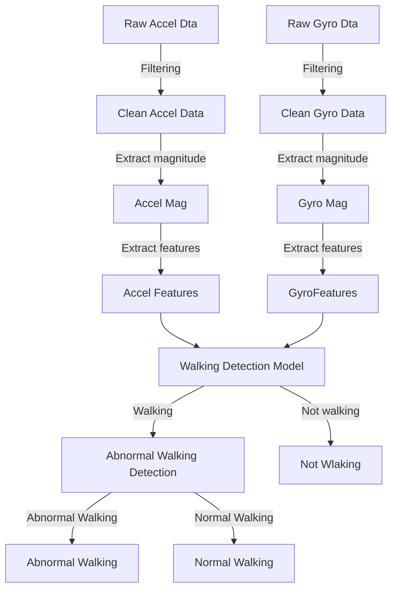

# Project Proposal:

Detecting abnormal gait can be useful for a variety of reasons. For example, “duck walking” is harmful for the knees and back, and can lead to injury if left uncaught. It is also useful to detect limping, which can be an underlying sign of further injury. Our project seeks to detect abnormal gait, so that a potential user could be notified if their walking gait needs to be fixed.

Due to the lack of real, authentic abnormal gait datasets online, we plan to collect all of our data by mimicking abnormal gait videos ourselves. All of our data will be collected by the accelerometer (and possibly gyroscope) on our phones. Each of our members will be performing normal gait walking and abnormal gait walking on solid ground, for each we will record the motion holding the phone and placing the phone in a pocket. Each recording will take a minute. In total, there will be 12 minutes of data separated by two classes – normal gait and abnormal gait. 

There will be three labels for the data we collect: not walking, normal walking, and abnormal walking. There will be a decision tree to first classify the data as either walking or not walking, and if the data is predicted to be walking, there will be a second decision tree to classify the data as either normal walking or abnormal walking. We plan to resample the walking data into sets of windows (after removing noise) from which features are extracted. To first classify the window as walking or not, we first extract the peaks for acceleration magnitude as well as the average acceleration for each window. To classify the window as normally walking versus abnormally walking, we find the peak accelerations in each window and extract the variation in peak acceleration. People who walk for a limp for example might have inconsistent footsteps and thus more variations in the acceleration of their steps. The magnitude of the orientation velocity is also used as people who walk abnormally might have a stronger swinging motion with their legs when they walk. 

# Data Collection

Not Walking:

- 5 minutes sitting
- 5 minutes lying down

Walking:

- Normal walking:
  - 5 minutes on session 1
  - 5 minutes on session 2
- Abnormal Walking:
  - 3 minutes limp walking session 1
  - 3 minutes limp walking session 2
  - 3 minutes duck walking session 1
  - 3 minutes duck walking session 2

### Data collection techniques:

**Abnormal walking**:

Simulated by normal college students.

- Limp walking:  
Phone placed in leaned-on leg pocket

- Duck walking:  
Walking with foot pointed outwards with shorter strides

# Data preprocessing

# Models:

| Data Trained On | Task |
| - | - |
| Accel only | Walking vs Not walking |
| Accel only | Normal vs Abnormal walking |
| Gyro only | Walking vs Not walking |
| Gryo only | Normal vs Abnormal walking |
|  Accel and Gyro | Walking vs Not walking |
| Accel and Gyro | Normal vs Abnormal walking |

## Combined model workflow

Code:

model.py: Decision tree classifier from sklearn

